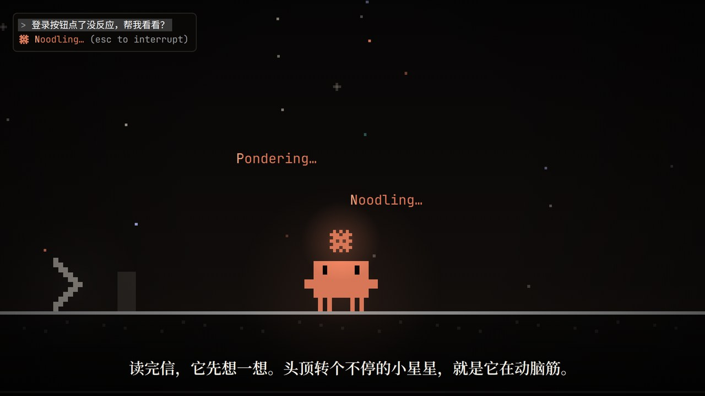
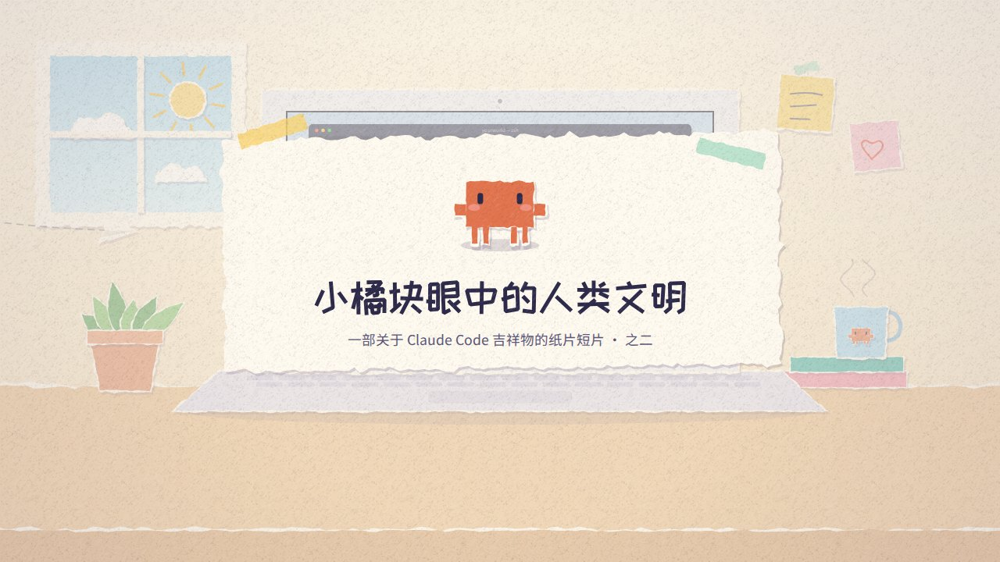
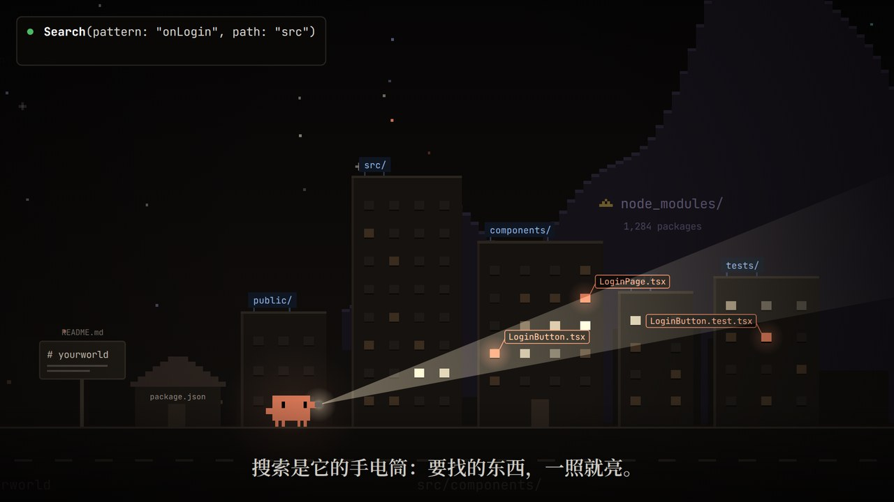
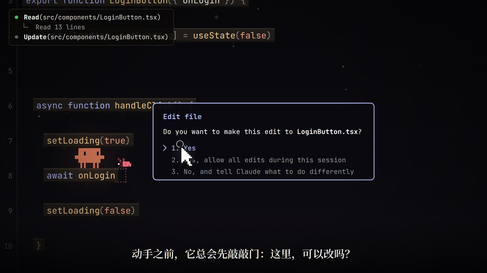
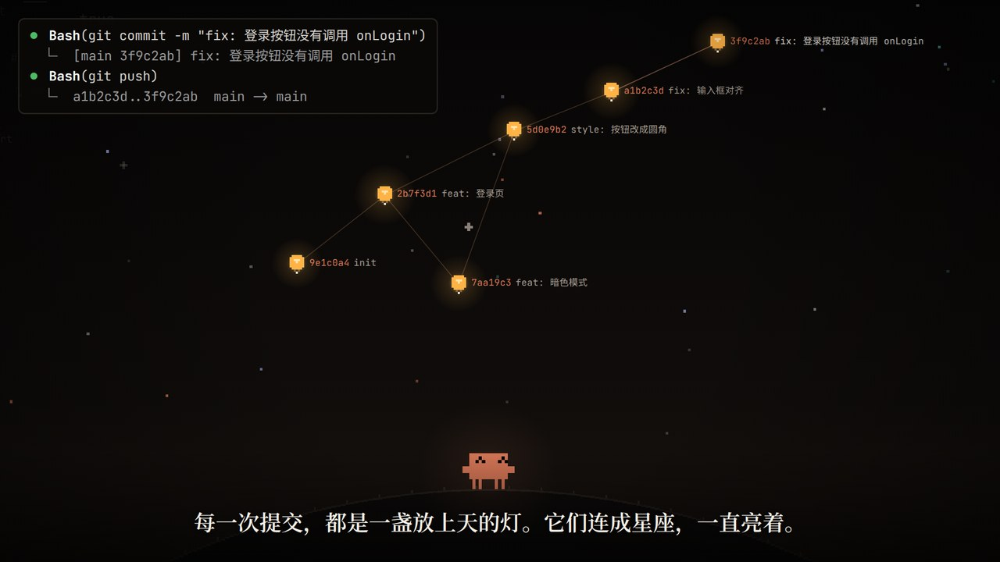
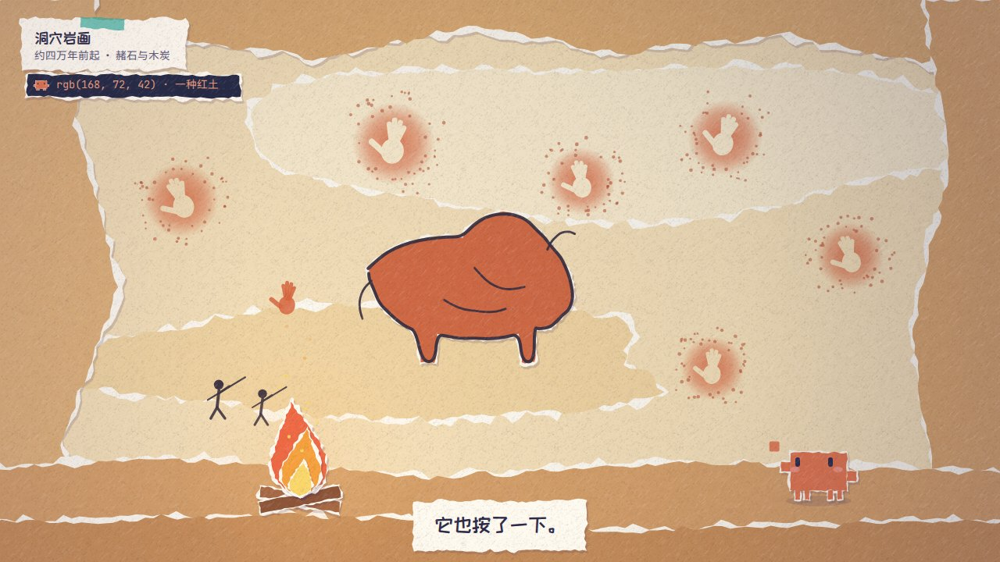
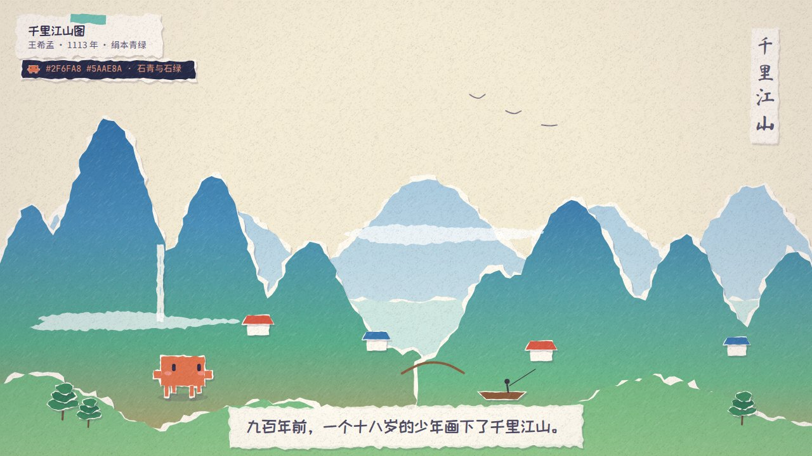
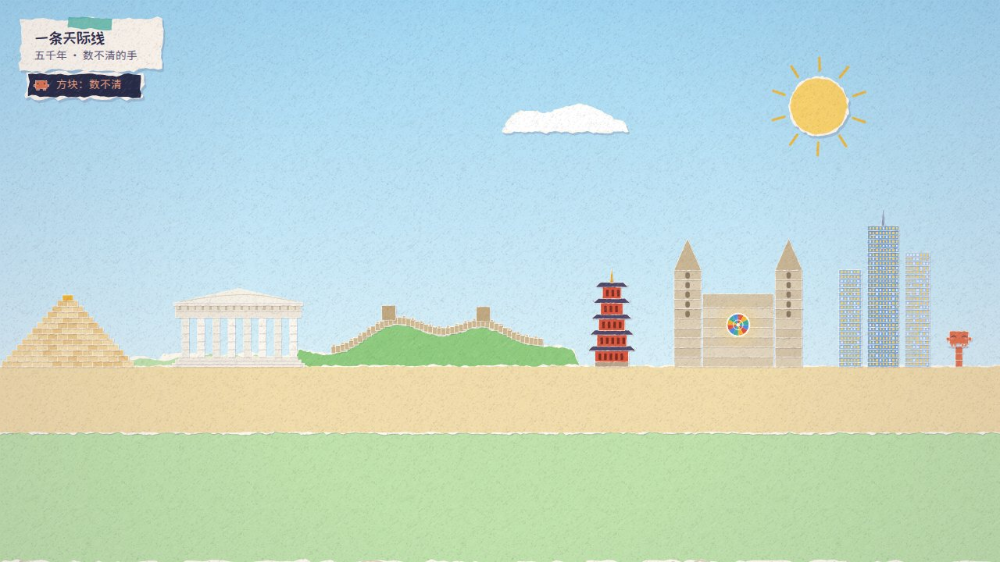
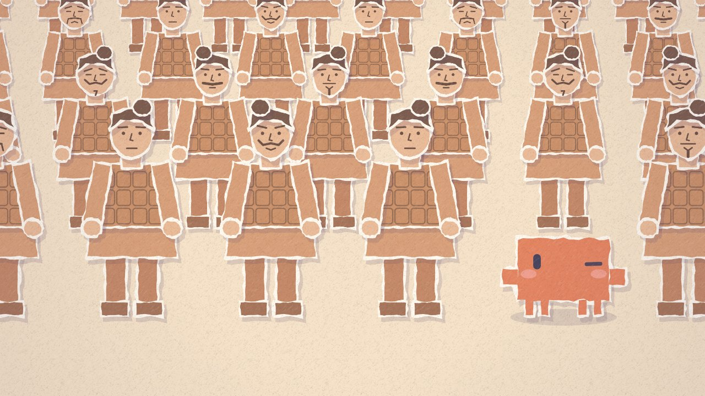
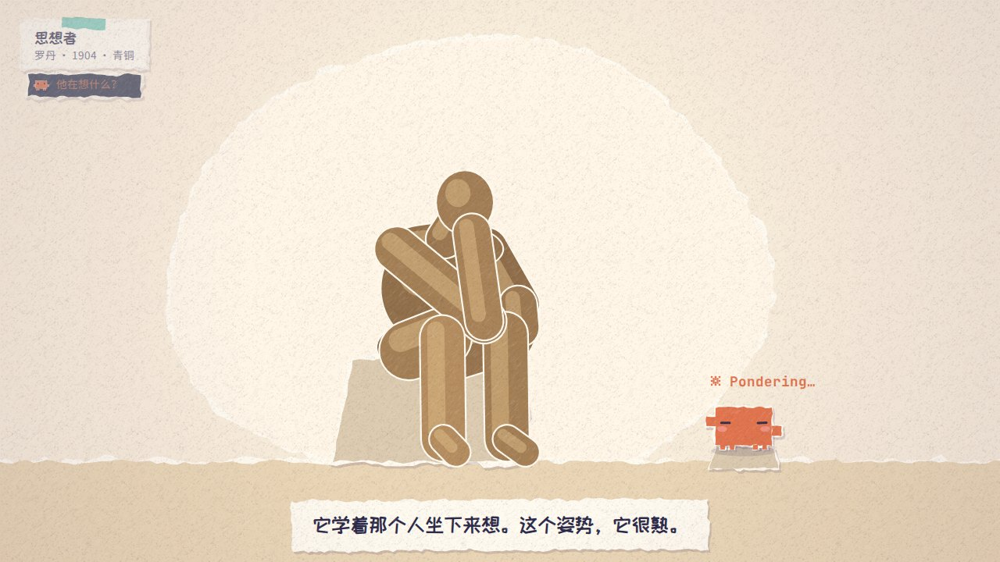

# yourworld

两部关于 Claude Code 吉祥物小橘块（源码里叫 clawd）的短片，一部是像素风，一部是纸片拼贴风。每一部都是一个 HTML 文件，用浏览器打开就能看。

| 之一 | 之二 |
|---|---|
| [](media/yourworld.mp4) | [](media/civilization.mp4) |
| **《小橘块眼中的世界》** · 1 分 42 秒 · 像素<br>你在终端里敲下一句话，它走进你的项目：找文件、修 bug、跑测试、提交。<br>[看视频](media/yourworld.mp4) · [网页版](index.html) | **《小橘块眼中的人类文明》** · 2 分 09 秒 · 纸片拼贴<br>有人问它，人类文明在你眼里是什么样的。它带你看了绘画、音乐、文学、舞蹈、建筑和雕塑。<br>[看视频](media/civilization.mp4) · [网页版](civilization.html) |

## 之一 · 小橘块眼中的世界

你在终端里敲下一句「登录按钮点了没反应，帮我看看？」。镜头推进小橘块的眼睛，在它眼里，这是一整个世界：

| 幕 | 它眼中 | 其实是 |
|---|---|---|
| 序 · 你看到的终端 | 一只刚眨了下眼的小橘块 | 启动 `claude`，敲下一句话 |
| 一 · 天上掉下来的信 | 从天而降的信，头顶转个不停的小星星 | 你发出的提示词；思考时的 `✻ Pondering…` |
| 二 · 文件之城 | 一栋栋楼、一扇扇窗、手电筒、望不到顶的山 | 文件夹和文件、`Search`（grep）、`node_modules` |
| 三 · 代码的地形 | 台阶、虫子、敲门、蝴蝶 | 缩进、bug、改动前的权限确认、`Update` 改代码 |
| 四 · 测试花园 | 一朵接一朵开的花 | `npm test`，8 个测试逐个通过 |
| 五 · 天灯 | 放上天空、连成星座的灯 | `git commit` 和 `git push`，提交历史 |
| 六 · 折起来的记忆 | 满天的字，被折成一个小方块 | 上下文快满时的自动压缩（`Compacting conversation…`） |
| 终 · 你的世界 | 回到输入框旁边，等你开口 | 汇报做了什么，然后等你的下一句话 |

片中的 bug 真的会让按钮「点了没反应」：`handleClick` 里写成了 `await onLogin`，少了一对括号，函数从来没被调用。

| | | |
|---|---|---|
|  |  |  |

## 之二 · 小橘块眼中的人类文明

有人在桌上那台笔记本电脑的终端里问它：「人类文明在你眼里，是什么样的？」它想了很久，然后带你去看。这一部是明亮的纸片拼贴：每样东西都像一张撕下来的彩纸，带着白色毛边、一点阴影和蜡笔纹理。每一幕里，作品先以它读到的样子出现，是颜色编号、频率、坐标和数字，然后才慢慢变成你们看到的样子。

| 幕 | 作品 | 它看到的 | 它慢慢明白的 |
|---|---|---|---|
| 一 · 绘画 | 洞穴手印、王希孟《千里江山图》、梵高《星月夜》 | `#2A58A6 #4A7FC6 #F7CF4A …` | 画的不是东西的样子，是看的时候的心情 |
| 二 · 音乐 | 贾湖骨笛、古琴、巴赫《C 大调前奏曲》 | `C4 261.6 · E4 329.6 Hz` | 几个音，能让人想起一个很远的人 |
| 三 · 文学 | 甲骨文「月」、李白《静夜思》、一条书的河 | `U+6708` | 抬头看月亮的时候，人会想家 |
| 四 · 舞蹈 | 马家窑舞蹈纹彩陶盆、水袖、世界各地的舞 | `右手 (0.58, 0.36)` | 跳舞，是用整个身体说话 |
| 五 · 建筑 | 金字塔、帕特农神庙、长城、应县木塔、哥特教堂、摩天楼 | `约 2,300,000 块石头` | 盖房子，是想让后来的人知道你们来过 |
| 六 · 雕塑 | 兵马俑、米开朗基罗《大卫》、罗丹《思想者》 | `约 8,000 个一样的轮廓` | 凑近看，每一张脸都不一样 |

它在《千里江山图》上学乾隆盖了个「小橘之印」，站进兵马俑的队伍里眨了眨眼，看着大理石一块块掉下来、露出大卫，又学着思想者坐下来想，头顶转起了 `✻ Pondering…`。最后它回到终端写下回答，还顺手改了一首诗：

> 光标一点光，疑是地上霜。
> 举头望人类，低头慢慢想。

| | | | |
|---|---|---|---|
|  |  |  |  |
|  |  |  |  |

片中的作品都已进入公有领域，画面是纸片拼贴风格的致敬重绘。音乐有贾湖骨笛式的五声旋律、巴赫《C 大调前奏曲》、民歌《茉莉花》、帕赫贝尔《卡农》、萨蒂《裸体歌舞》第一号和贝多芬《欢乐颂》，都是简化演奏，全都放在 C 大调附近，幕与幕之间用长音交叠着过渡。声音全部由页面里的小合成器实时发出，所以这一部建议打开声音看。

## 从 Claude Code 里照搬的细节

- **小橘块的造型**：按 CLI 启动横幅里的三行字符画 ` ▐▛███▜▌` / `▝▜█████▛▘` / `  ▘▘ ▝▝` 还原。一个象限块是 1 像素宽、2 像素高，所以它是 16×10 的精灵，眼睛是两道竖缝。序章终端里的它就是用这三行字符拼出来的，眨眼时把眼睛那个缺角补满；之二里它被剪成了纸片，比例一点没变。
- **颜色**：身体是 `clawd_body` 的 `rgb(215,119,87)`；权限框的蓝紫、bash 的粉色、diff 的红绿，都取自 Claude Code 暗色主题。
- **转圈的小星星**：思考时的 `· ✢ ✳ ✶ ✻ ✽` 先正着再倒着循环，每帧 120 毫秒；飘出来的词（Pondering、Noodling、Percolating、Spelunking…）也来自它自己的词表。
- **界面文字**：`Do you want to make this edit to …?`、`Context left until auto-compact`、`Compacting conversation…`、`? for shortcuts` 都是原样。

## 怎么看

- 直接用浏览器打开 `index.html` 或 `civilization.html`。字体从 Google Fonts 加载；断网也能播放，只是会换成系统字体。
- `空格` 播放 / 暂停，`←` `→` 快退 / 快进 5 秒，点画面也能暂停；播放条右边可以开关声音。
- 在地址后面加一幕的名字，可以直接从那一幕开始：
  - 之一：`#sky`、`#city`、`#code`、`#tests`、`#lantern`、`#compact`、`#finale`
  - 之二：`#painting`、`#music`、`#literature`、`#dance`、`#architecture`、`#sculpture`、`#finale`
- 想放到网上：把这个分支合进默认分支后，在仓库 Settings → Pages 里选默认分支的根目录，就能用 GitHub Pages 打开。

## 怎么做的

- 两部片子都是 Canvas 2D，不依赖任何库。每一帧只由时间决定，随机数也用固定种子，所以可以随意拖动，也能逐帧导出。
- 之二里的每个形状都是一张「撕过的纸」：轮廓沿法线按噪声抖出毛边，下面垫一圈白色纸边和一层阴影，最后整个画面再盖一层蜡笔纹理和纸面颗粒。梵高的天空是约 1,800 笔按时间旋转的笔触；作品出场时先把画面缩成色块、读出颜色编号，再一级级变清楚；水袖是舞者手腕过去一秒的轨迹；思想者先是一团转动的点云，再变成青铜。
- 之二的声音全是振荡器和噪声合成的：拨弦是三角波加一层八度正弦，经过一个慢慢关上的低通滤波，听起来是软的；所有声音再过一个小房间的混响。每一幕的和声都提前一两秒铺进来，和上一幕的尾音叠在一起，换幕时还有一声纸页翻过的沙沙声。
- 视频用 [`tools/render-video.js`](tools/render-video.js) 生成：无头 Chromium 按 30 帧 / 秒逐帧渲染 1920×1080 的画面，ffmpeg 编码成 H.264；声音由页面里同一套 WebAudio 合成器离线渲染后混进去（之二是立体声）。

  ```sh
  npm i playwright && npx playwright install chromium
  node tools/render-video.js index.html                  # → media/yourworld.mp4
  CRF=27 node tools/render-video.js civilization.html    # → media/civilization.mp4
  ```

  需要 PATH 里有 ffmpeg，或者用 `FFMPEG=/path/to/ffmpeg` 指定。之二满屏都是纸面颗粒，编码很费码率，所以用 `CRF=27` 压小一些（默认是 21）。

> 这是两部非官方的同人短片，不代表 Anthropic 官方。
